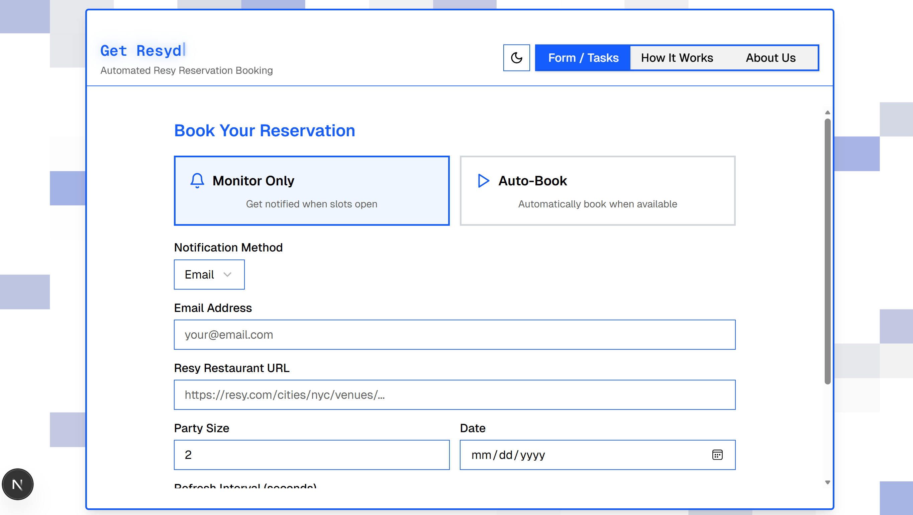
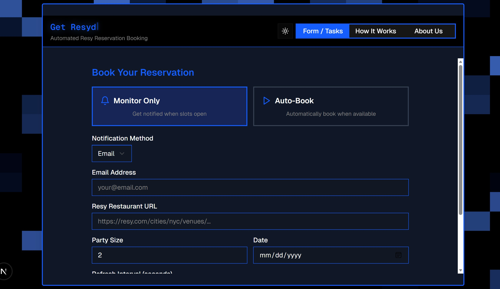
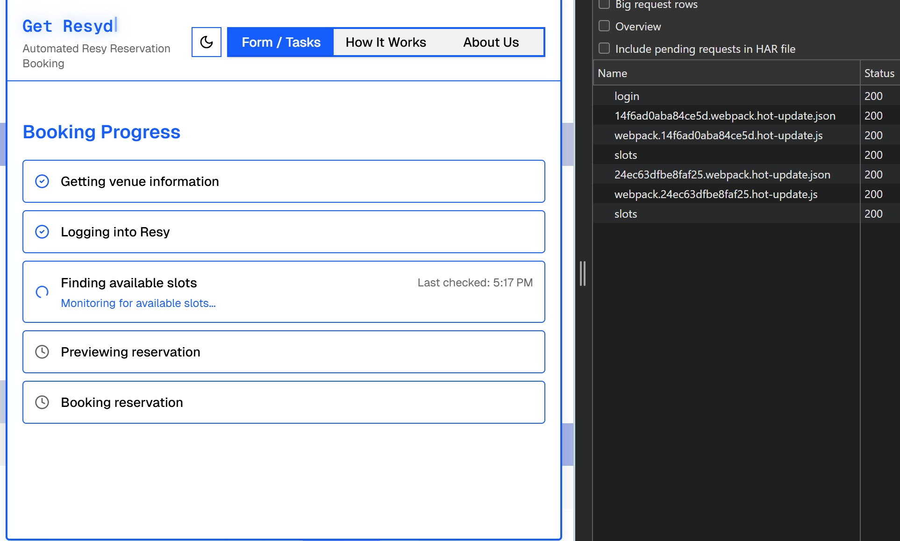
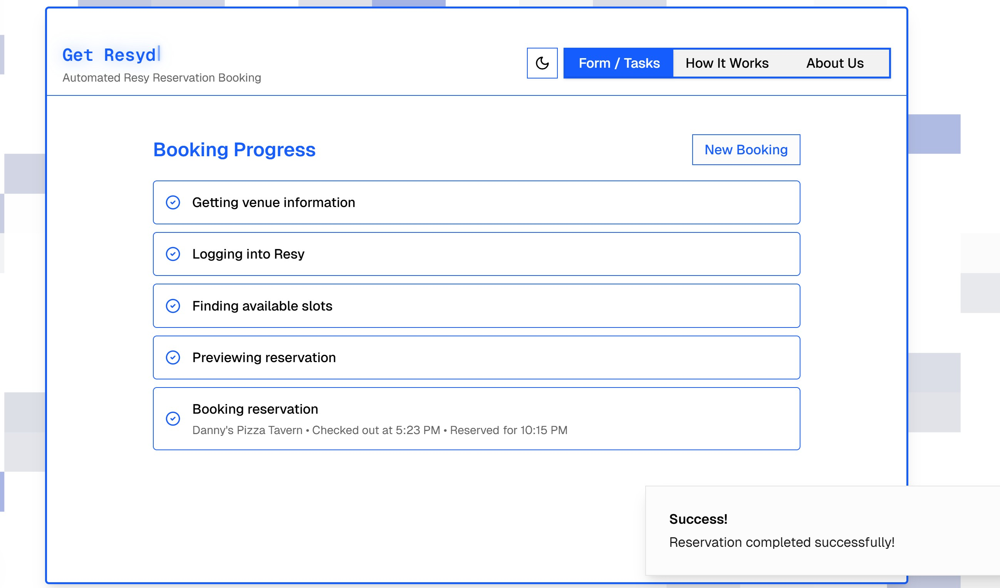
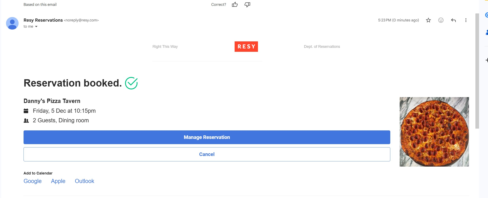

# Resy

Restaurant reservation booking system built, so far, on Resy's API with a custom backend.

## Why

I kept running into the same problem: couldn't get reservations at busy restaurants around the city, especially when trying to book last minute. Manual checking wasn't working, so I built this to automate it. Now it monitors for availability and books slots automatically when they open up. (I have actually succesfully secured multiple last minute reservations for myself and friends. This comes in very handy when you need)

## What It Does

Two modes to match how you want to roll: monitor-only for notifications when slots open, or full auto-booking that handles everything end to end. The system continuously checks for availability at your chosen restaurant, handles authentication, navigates the booking flow, and secures the reservation instantly when something opens up. Real-time monitoring with configurable refresh intervals means you're always first in line. Works with any restaurant on Resy.

## Run app

For backend:
uvicorn app.main:app --reload --host 127.0.0.1 --port 8000

For frontend:
npm run dev

## Screenshots

Backend API screens:

Monitoring mode:

Successful booking at Danny's Pizza Tavern:

Confirmation email:

## Built With

**Backend:**
- FastAPI (Python)
- APScheduler for background tasks

**Frontend:**
- Next.js 15
- React 19
- TypeScript
- Tailwind CSS
- Radix UI components

## Setup

If you're cloning and using this project, make sure to set your backend `.env` `MODE` to `production`. Otherwise, it will not fully complete the booking process (development mode skips actual bookings).

## API Endpoints

- `POST /api/v1/resy/login` - Authenticate with Resy
- `POST /api/v1/resy/getID` - Extract venue ID from Resy URL
- `POST /api/v1/resy/slots` - Get available reservation slots
- `POST /api/v1/resy/calendar` - Get available dates for a venue
- `POST /api/v1/resy/reservation/preview` - Preview reservation details
- `POST /api/v1/resy/reservation/book` - Confirm booking

## Future Plans

OpenTable support is already built out in the backend, just needs frontend integration. If there's enough interest, that's next. Also exploring ExploreTok integration for better restaurant discovery. The goal is expanding to cover all major booking platforms so you can get into any place you want, regardless of where they're listed.

